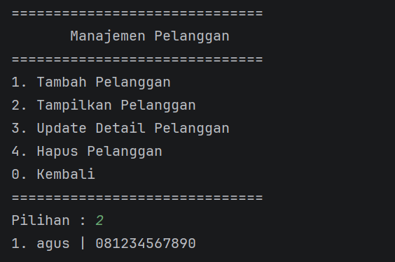
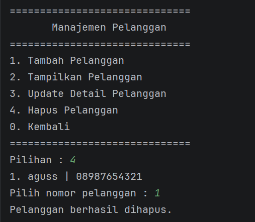
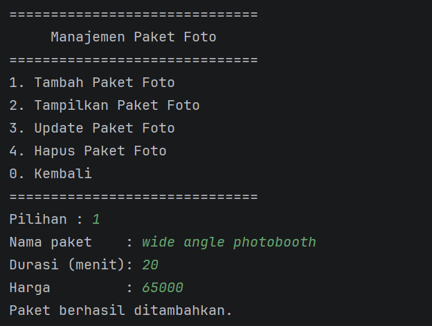
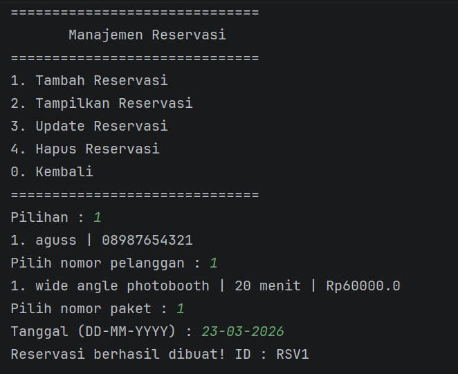
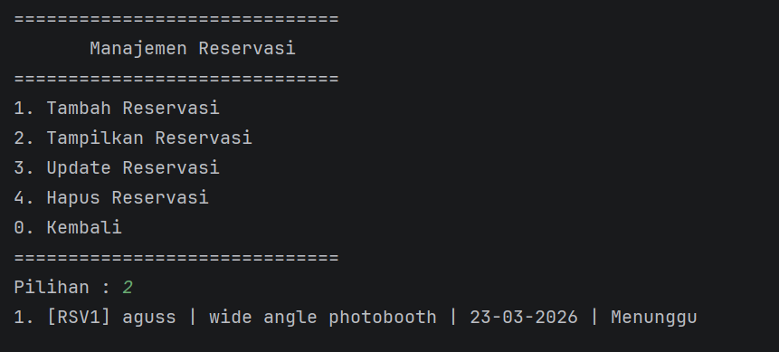

# Sistem Manajemen Reservasi Foto Studio

**Nama  :** Inayah Ramadhani  
**NIM   :** 2409106068  
**Kelas :** PBO B1'24

---

## Analisis Program

Program ini merupakan Sistem Manajemen Reservasi Foto Studio dari sisi admin. Admin dapat mengelola data pelanggan, paket foto, dan reservasi secara lengkap. Program menggunakan tiga class yaitu `Pelanggan`, `Paket`, dan `Reservasi`, di mana `Reservasi` menghubungkan objek `Pelanggan` dan `Paket` yang sudah tersimpan.

---

## Source Code

### A. Class Pelanggan
Menyimpan data pelanggan berupa nama dan nomor HP.
```java
class Pelanggan {
    String nama;
    String noHp;
    Pelanggan(String nama, String noHp) {
        this.nama = nama;
        this.noHp = noHp;
    }
}
```

### B. Class Paket
Menyimpan data paket foto berupa nama paket, durasi (menit), dan harga.
```java
class Paket {
    String namaPaket;
    int durasi;
    double harga;
    Paket(String namaPaket, int durasi, double harga) {
        this.namaPaket = namaPaket;
        this.durasi = durasi;
        this.harga = harga;
    }
}
```

### C. Class Reservasi
Menghubungkan objek `Pelanggan` dan `Paket`, dilengkapi tanggal dan status reservasi yang di-set otomatis ke `"Menunggu"` yang nantinya dapat diubah pada menu `Update Reservasi` jika reservasi telah selesai.
```java
class Reservasi {
    String idReservasi;
    Pelanggan pelanggan;
    Paket paket;
    String tanggal;
    String status;
    Reservasi(String idReservasi, Pelanggan pelanggan, Paket paket, String tanggal) {
        this.idReservasi = idReservasi;
        this.pelanggan = pelanggan;
        this.paket = paket;
        this.tanggal = tanggal;
        this.status = "Menunggu";
    }
}
```

### D. Menu Utama
Program berjalan dalam loop `do-while` hingga pengguna memilih `0` untuk keluar.
```java
void main() {
    ArrayList<Pelanggan> daftarPelanggan = new ArrayList<>();
    ArrayList<Paket> daftarPaket = new ArrayList<>();
    ArrayList<Reservasi> daftarReservasi = new ArrayList<>();
    Scanner input = new Scanner(System.in);
    int pilihan;
    do {
        switch (pilihan) {
            case 1 -> menuPelanggan(daftarPelanggan, input);
            case 2 -> menuPaket(daftarPaket, input);
            case 3 -> menuReservasi(daftarReservasi, daftarPelanggan, daftarPaket, input);
            case 0 -> System.out.println("Sampai jumpa!");
        }
    } while (pilihan != 0);
}
```

### E. Tambah Data
Pengguna memasukkan data melalui `Scanner`, lalu objek baru ditambahkan ke `ArrayList`.
```java
void TambahPelanggan(ArrayList<Pelanggan> daftarPelanggan, Scanner input) {
    System.out.print("Nama  : ");
    String nama = input.nextLine();
    System.out.print("No HP : ");
    String noHp = input.nextLine();
    daftarPelanggan.add(new Pelanggan(nama, noHp));
    System.out.println("Pelanggan berhasil ditambahkan.");
}
```

### F. Tampil Data
Jika `ArrayList` kosong, akan menampilkan pesan "Belum ada pelanggan". Hal yang sama juga berlaku pada menu `Tampilkan Paket Foto` dan `Tampilkan Reservasi`. Jika ada data, maka akan ditampilkan dengan nomor urut.
```java
void TampilPelanggan(ArrayList<Pelanggan> daftarPelanggan) {
    if (daftarPelanggan.isEmpty()) {
        System.out.println("Belum ada pelanggan.");
        return;
    }
    int no = 1;
    for (Pelanggan p : daftarPelanggan) {
        System.out.println(no++ + ". " + p.nama + " | " + p.noHp);
    }
}
```

### G. Update Data
Daftar ditampilkan terlebih dahulu, lalu pengguna memilih nomor data yang ingin diubah. Data diperbarui langsung melalui referensi objek.
```java
void UpdatePelanggan(ArrayList<Pelanggan> daftarPelanggan, Scanner input) {
    TampilPelanggan(daftarPelanggan);
    System.out.print("Pilih nomor pelanggan : ");
    int index = Integer.parseInt(input.nextLine()) - 1;
    Pelanggan target = daftarPelanggan.get(index);
    System.out.print("Nama baru  : ");
    target.nama = input.nextLine();
    System.out.print("No HP baru : ");
    target.noHp = input.nextLine();
    System.out.println("Pelanggan berhasil diupdate.");
}
```

### H. Hapus Data
Daftar ditampilkan, pengguna memilih nomor, lalu data dihapus menggunakan `remove(index)`.
```java
void HapusPelanggan(ArrayList<Pelanggan> daftarPelanggan, Scanner input) {
    TampilPelanggan(daftarPelanggan);
    System.out.print("Pilih nomor pelanggan : ");
    int index = Integer.parseInt(input.nextLine()) - 1;
    daftarPelanggan.remove(index);
    System.out.println("Pelanggan berhasil dihapus.");
}
```

### I. Tambah Reservasi
Menampilkan daftar pelanggan dan paket agar pengguna dapat memilih berdasarkan nomor. ID reservasi dibuat otomatis dari ukuran ArrayList.
```java
void TambahReservasi(ArrayList<Reservasi> daftarReservasi, ArrayList<Pelanggan> daftarPelanggan,
                     ArrayList<Paket> daftarPaket, Scanner input) {
    TampilPelanggan(daftarPelanggan);
    int iPelanggan = Integer.parseInt(input.nextLine()) - 1;
    TampilPaket(daftarPaket);
    int iPaket = Integer.parseInt(input.nextLine()) - 1;
    String tanggal = input.nextLine();
    String id = "RSV" + (daftarReservasi.size() + 1);
    daftarReservasi.add(new Reservasi(id, daftarPelanggan.get(iPelanggan), daftarPaket.get(iPaket), tanggal));
    System.out.println("Reservasi berhasil dibuat! ID : " + id);
}
```

---

## Uji Coba dan Hasil Output

### Menu Utama


---
### Tambah Pelanggan


### Tampilkan Pelanggan (kosong)


### Tampil Pelanggan (ada data)


### Update Pelanggan


### Hapus Pelanggan


---
### Tambah Paket Foto


### Tampilakan Paket Foto (kosong)


### Tampilkan Paket Foto (ada data)


### Update Paket Foto


### Hapus Paket Foto


---
### Tambah Reservasi


### Tampilkan Reservasi (kosong)


### Tampilkan Reservasi (ada data)


### Update Reservasi


### Hapus Reservasi


---