# Sistem Manajemen Reservasi Foto Studio

**Nama  :** Inayah Ramadhani  
**NIM   :** 2409106068  
**Kelas :** PBO B1'24

---

## Analisis Program

Program ini merupakan Sistem Manajemen Reservasi Foto Studio dari sisi admin. Admin dapat mengelola data pelanggan, paket foto, dan reservasi secara lengkap. Program menggunakan tiga class yaitu `Pelanggan`, `Paket`, dan `Reservasi`, di mana `Reservasi` menghubungkan objek `Pelanggan` dan `Paket` yang sudah tersimpan.

---

## Source Code

### A. Class Pelanggan
Properti `nama` dan `noHp` dibuat `private`. `setNama` dan `setNoHp` memvalidasi agar nilai tidak boleh kosong. Jika tidak valid, hanya mencetak pesan peringatan dan nilai tidak diubah.
```java
class Pelanggan {
    private String nama;
    private String noHp;

    Pelanggan(String nama, String noHp) {
        setNama(nama);
        setNoHp(noHp);
    }

    public String getNama() {
        return nama;
    }

    public void setNama(String nama) {
        if (nama == null || nama.isEmpty()) {
            System.out.println("Nama tidak boleh kosong.");
        } else {
            this.nama = nama;
        }
    }

    public String getNoHp() {
        return noHp;
    }

    public void setNoHp(String noHp) {
        if (noHp == null || noHp.isEmpty()) {
            System.out.println("No HP tidak boleh kosong.");
        } else {
            this.noHp = noHp;
        }
    }
}
```

### B. Class Paket
Properti `namaPaket`, `durasi`, dan `harga` dibuat `private`. `setDurasi` memvalidasi agar durasi harus lebih dari 0 menit, dan `setHarga` memvalidasi agar harga tidak boleh bernilai negatif.
```java
class Paket {
    private String namaPaket;
    private int durasi;
    private double harga;

    Paket(String namaPaket, int durasi, double harga) {
        setNamaPaket(namaPaket);
        setDurasi(durasi);
        setHarga(harga);
    }

    public String getNamaPaket() {
        return namaPaket;
    }

    public void setNamaPaket(String namaPaket) {
        if (namaPaket == null || namaPaket.isEmpty()) {
            System.out.println("Nama paket tidak boleh kosong.");
        } else {
            this.namaPaket = namaPaket;
        }
    }

    public int getDurasi() {
        return durasi;
    }

    public void setDurasi(int durasi) {
        if (durasi <= 0) {
            System.out.println("Durasi harus lebih dari 0 menit.");
        } else {
            this.durasi = durasi;
        }
    }

    public double getHarga() {
        return harga;
    }

    public void setHarga(double harga) {
        if (harga < 0) {
            System.out.println("Harga tidak boleh negatif.");
        } else {
            this.harga = harga;
        }
    }
}
```

### C. Class Reservasi
Seluruh properti dibuat `private`. `idReservasi` hanya memiliki getter karena ID tidak boleh diubah setelah reservasi dibuat. `setTanggal` dan `setStatus` memvalidasi agar nilai tidak boleh kosong.
```java
class Paket {
    private String namaPaket;
    private int durasi;
    private double harga;

    Paket(String namaPaket, int durasi, double harga) {
        setNamaPaket(namaPaket);
        setDurasi(durasi);
        setHarga(harga);
    }

    public String getNamaPaket() {
        return namaPaket;
    }

    public void setNamaPaket(String namaPaket) {
        if (namaPaket == null || namaPaket.isEmpty()) {
            System.out.println("Nama paket tidak boleh kosong.");
        } else {
            this.namaPaket = namaPaket;
        }
    }

    public int getDurasi() {
        return durasi;
    }

    public void setDurasi(int durasi) {
        if (durasi <= 0) {
            System.out.println("Durasi harus lebih dari 0 menit.");
        } else {
            this.durasi = durasi;
        }
    }

    public double getHarga() {
        return harga;
    }

    public void setHarga(double harga) {
        if (harga < 0) {
            System.out.println("Harga tidak boleh negatif.");
        } else {
            this.harga = harga;
        }
    }
}
```

### D. Menu Utama
Program berjalan dalam loop `do-while` hingga pengguna memilih `0` untuk keluar.
```java
void main() {
    ArrayList<Pelanggan> daftarPelanggan = new ArrayList<>();
    ArrayList<Paket> daftarPaket = new ArrayList<>();
    ArrayList<Reservasi> daftarReservasi = new ArrayList<>();
    Scanner input = new Scanner(System.in);
    int pilihan;
    do {
        switch (pilihan) {
            case 1 -> menuPelanggan(daftarPelanggan, input);
            case 2 -> menuPaket(daftarPaket, input);
            case 3 -> menuReservasi(daftarReservasi, daftarPelanggan, daftarPaket, input);
            case 0 -> System.out.println("Sampai jumpa!");
        }
    } while (pilihan != 0);
}
```

### E. Tambah Data
Input divalidasi sebelum objek ditambahkan ke ArrayList. Jika tidak valid, proses dibatalkan dan objek tidak jadi ditambahkan. Pola ini berlaku untuk Pelanggan, Paket, dan Reservasi.
```java
void TambahPelanggan(ArrayList<Pelanggan> daftarPelanggan, Scanner input) {
    System.out.print("Nama  : ");
    String nama = input.nextLine();
    System.out.print("No HP : ");
    String noHp = input.nextLine();

    if (nama.isEmpty() || noHp.isEmpty()) {
        System.out.println("Gagal menambahkan pelanggan. Nama dan No HP tidak boleh kosong.");
        return;
    }
    daftarPelanggan.add(new Pelanggan(nama, noHp));
    System.out.println("Pelanggan berhasil ditambahkan.");
}
```

### F. Tampil Data
Jika ArrayList kosong, mencetak pesan "Belum ada ...". Akses data menggunakan getter. Pada `TampilReservasi`, getter dipanggil secara berantai untuk mengakses data dari objek yang tersimpan di dalam Reservasi.
```java
void TampilPelanggan(ArrayList<Pelanggan> daftarPelanggan) {
    if (daftarPelanggan.isEmpty()) {
        System.out.println("Belum ada pelanggan.");
        return;
    }
    int no = 1;
    for (Pelanggan p : daftarPelanggan) {
        System.out.println(no++ + ". " + p.getNama() + " | " + p.getNoHp());
    }
}
```

### G. Update Data
Input baru ditampung, divalidasi, lalu dimasukkan lewat setter. Jika tidak valid, proses dibatalkan dan data tidak berubah. Pola ini berlaku untuk Pelanggan, Paket, dan Reservasi.
```java
void UpdatePelanggan(ArrayList<Pelanggan> daftarPelanggan, Scanner input) {
    TampilPelanggan(daftarPelanggan);
    System.out.print("Pilih nomor pelanggan : ");
    int index = Integer.parseInt(input.nextLine()) - 1;
    Pelanggan target = daftarPelanggan.get(index);

    System.out.print("Nama baru  : ");
    String namaBaru = input.nextLine();
    System.out.print("No HP baru : ");
    String noHpBaru = input.nextLine();
    if (namaBaru.isEmpty() || noHpBaru.isEmpty()) {
        System.out.println("Gagal mengupdate. Nama dan No HP tidak boleh kosong.");
        return;
    }
    target.setNama(namaBaru);
    target.setNoHp(noHpBaru);
    System.out.println("Pelanggan berhasil diupdate.");
}
```

### H. Hapus Data
Daftar ditampilkan, pengguna memilih nomor, lalu data dihapus menggunakan `remove(index)`. Pola ini berlaku untuk Pelanggan, Paket, dan Reservasi.
```java
void HapusPelanggan(ArrayList<Pelanggan> daftarPelanggan, Scanner input) {
    TampilPelanggan(daftarPelanggan);
    System.out.print("Pilih nomor pelanggan : ");
    int index = Integer.parseInt(input.nextLine()) - 1;
    daftarPelanggan.remove(index);
    System.out.println("Pelanggan berhasil dihapus.");
}
```
---

## Uji Coba dan Hasil Output

### Menu Utama
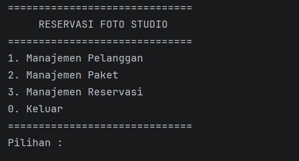

---
### Tambah Pelanggan
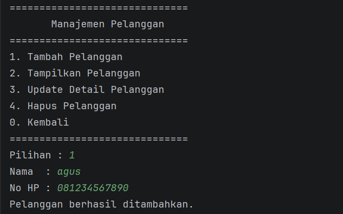

### Tampilkan Pelanggan (kosong)
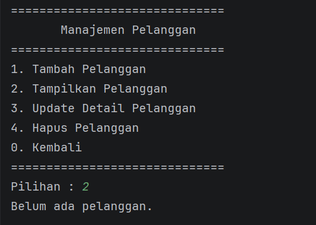

### Tampil Pelanggan (ada data)


### Update Pelanggan
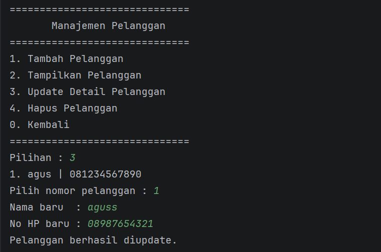

### Hapus Pelanggan


---
### Tambah Paket Foto


### Tampilakan Paket Foto (kosong)
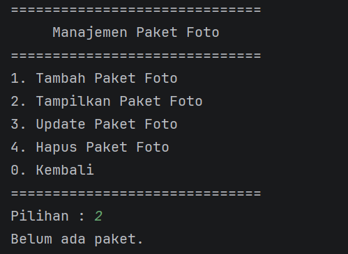

### Tampilkan Paket Foto (ada data)
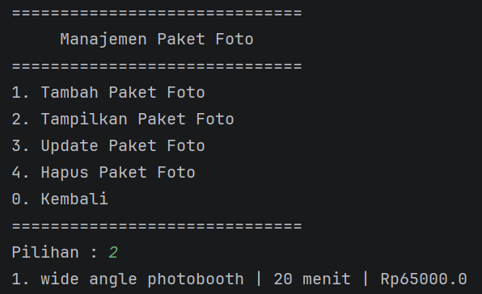

### Update Paket Foto
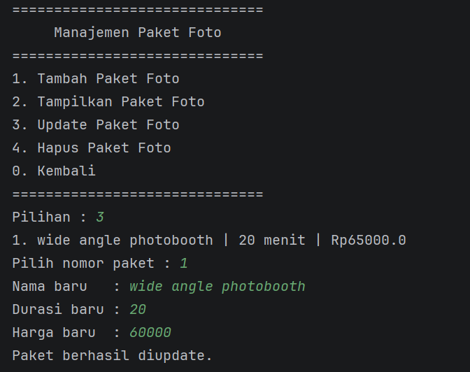

### Hapus Paket Foto
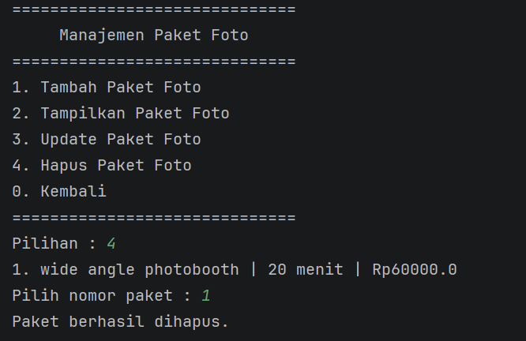

---
### Tambah Reservasi


### Tampilkan Reservasi (kosong)
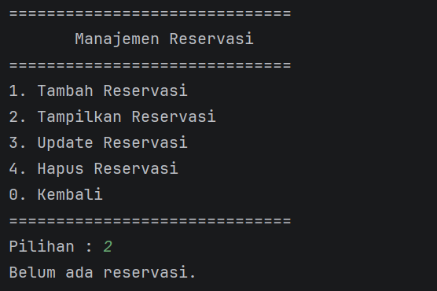

### Tampilkan Reservasi (ada data)


### Update Reservasi
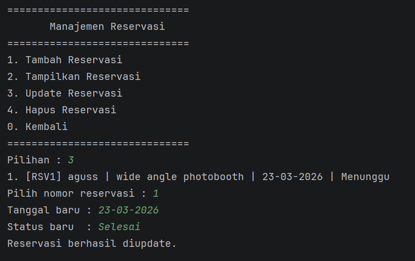

### Hapus Reservasi
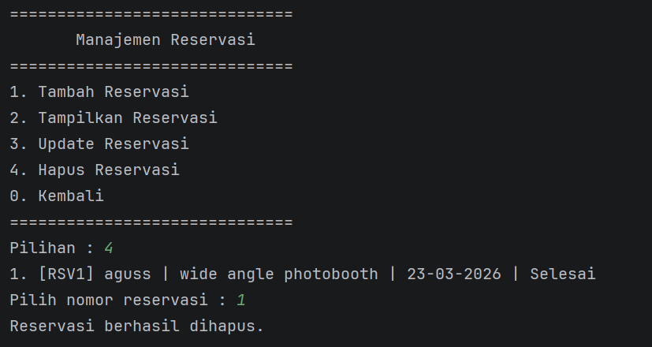

---